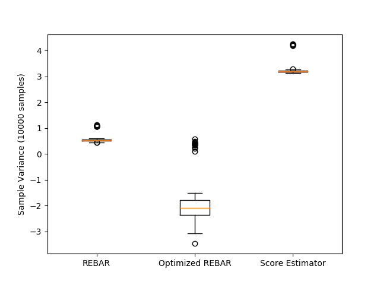

# REBAR/RELAX
A Python implementation of the gradient REBAR and RELAX estimator.

This Python module implements the RELAX gradient estimator (Grathwohl et al.) by way of the function `RELAX(...)`, which takes Tensorflow tensors corresponding to the scalar quantity to be differentiated along with tensors representing a control variate and the same control variate using a conditional noise variable. The function then uses Tensorflow to compute the appropriate gradients.
The REBAR estimator (Tucker et al.) is a canonical instance of RELAX which uses a relaxed sampling procedure for the control variate.
The auxiliary functions necessary for computing REBAR/RELAX estimators for both binary and categorical random variables are already implemented.
Finally, the module supports dynamic REBAR/RELAX: taking gradients with respect to estimator variance so that the method can be tuned automatically.

There are two modules:
* relax - which implements the RELAX estimator and includes a small demo script (see below)
* reparam - which implements a general class for discrete reparameterizations, as well as particular reparameterizations for categorical and binary random variables.

Implementing a categorical REBAR estimator can be as easy as
```
#construct reparameterization of categorical distribution with param as parameter.
rep = CategoricalReparam(hard_param) 
#calculate REBAR and dynamic REBAR gradients for loss f with control variate parameter nu
grad, var_grad = RELAX(*rep.rebar_params(f, weight=nu), [hard_param], var_params=[nu]) 
```

Running the `relax.py` module as a script starts a small demo illustrating the advantages of using REBAR



Here, REBAR clearly outperforms the standard score estimator in terms of variance, and optimizing the hyperparameters reduces the variance further. We also show the effect of using coupled noise as suggested in the appendix of Tucker et al.

### Custom estimators
To make a novel REBAR estimator, the safest choice is to build a subclass of `DiscreteReparam` for your distribution and use the `rebar_params` method as in the example above. To use RELAX, it's best to again subclass `DiscreteReparam` and then construct the desired control variate using the attributes. If you choose to feed arbitrary tensors to `RELAX`, take care that the proper conditional relationship holds between the two control tensors `control` and `conditional_control`, and ensure that `tf.stop_gradient` is used to block signals through non-differentiable elements.


## References:

G. Tucker, A. Mnih, C. J. Maddison, D. Lawson, and J. Sohl-Dickstein, “REBAR: Low-variance, unbiased gradient estimates for discrete latent variable models,” arXiv [cs.LG], 21-Mar-2017.

W. Grathwohl, D. Choi, Y. Wu, G. Roeder, and D. Duvenaud, “Backpropagation through the Void: Optimizing control variates for black-box gradient estimation,” arXiv [cs.LG], 31-Oct-2017.
