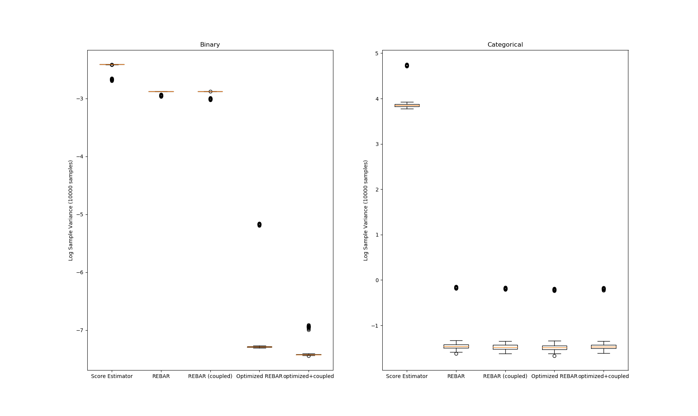

# REBAR/RELAX
A Python implementation of the gradient REBAR and RELAX estimator.

This Python module implements the RELAX gradient estimator by way of the function RELAX(), which takes Tensorflow tensors corresponding to the scalar quantity to be differentiated along with tensors representing a control variate and the same control variate using a conditional noise variable. The function then uses Tensorflow to compute the appropriate gradients.
The auxiliary functions necessary for computing REBAR/RELAX estimators for both binary and categorical random variables are already implemented.
Finally, the module supports dynamic REBAR/RELAX: taking gradients with respect to estimator variance so that the method can be tuned automatically.

The central functions are:
RELAX - the most general gradient estimator, implementing the RELAX estimator for general losses, controls, and distributions.
buildcontrol - a canonical construction of loss and control tensors for use in RELAX. 
REBAR - a composition of buildcontrol and RELAX, implementing the original REBAR estimator.

Running the module as a script starts a small demo illustrating the advantages of using REBAR

Here, REBAR clearly outperforms the standard score estimator in terms of variance, and optimizing the hyperparameters reduces the variance further.
